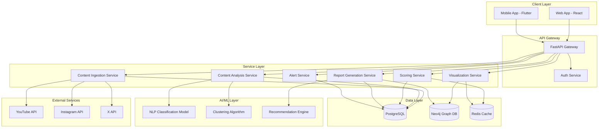

# Design Document: MindMap AI

## Overview

MindMap AI is a cognitive analytics platform built on a microservices architecture that processes user content consumption data from optional social platform connections and generates actionable insights through AI-powered analysis. The system consists of five primary layers:

1. **Integration Layer**: Handles optional OAuth authentication and content ingestion from YouTube, Instagram, X, browser history uploads, or manual link imports
2. **Analysis Layer**: Processes content using NLP models to extract topics, sentiment, and categorization
3. **Storage Layer**: Dual-database architecture using PostgreSQL for relational data and Neo4j for graph relationships
4. **Intelligence Layer**: Generates productivity scores, detects patterns, and produces recommendations based on available data
5. **Presentation Layer**: Delivers interactive visualizations and reports through web and mobile interfaces with data completeness indicators

The design prioritizes scalability (1M users), performance (10s processing time), security (end-to-end encryption), privacy (no data resale), and flexibility (works with any combination of data sources).

## Architecture

### System Architecture Diagram



### Architecture Patterns

**Microservices Architecture**: Each major function (ingestion, analysis, scoring, visualization, reporting, alerts) is implemented as an independent service that can scale horizontally.

**Event-Driven Processing**: Content ingestion triggers asynchronous analysis jobs using a message queue (e.g., RabbitMQ or AWS SQS) to decouple services and enable parallel processing.

**CQRS Pattern**: Separate read and write models where writes go to PostgreSQL and frequently-read data is cached in Redis, with Neo4j optimized for graph queries.

**API Gateway Pattern**: Single entry point (FastAPI) that handles authentication, rate limiting, request routing, and response aggregation.

## Components and Interfaces

### 1. Authentication Service

**Responsibility**: Manages user authentication, optional OAuth flows, and session management.

**Interfaces**:

```python
class AuthenticationService:
    def authenticate_oauth(provider: str, auth_code: str) -> AuthToken:
        """
        Completes OAuth flow for Google/YouTube authentication (OPTIONAL).
        Returns encrypted auth token valid for 24 hours.
        Raises AuthenticationError if OAuth fails.
        """
    
    def validate_token(token: str) -> User:
        """
        Validates authentication token and returns user object.
        Raises InvalidTokenError if token is expired or invalid.
        """
    
    def refresh_token(refresh_token: str) -> AuthToken:
        """
        Refreshes expired authentication token.
        """
    
    def revoke_access(user_id: str, provider: str) -> bool:
        """
        Revokes OAuth access for a specific provider.
        """
    
    def get_connected_sources(user_id: str) -> List[str]:
        """
        Returns list of connected data sources for the user.
        Used to display data completeness indicators.
        """
```

**Dependencies**: OAuth2 libraries, JWT token management, PostgreSQL for user storage

### 2. Content Ingestion Service

**Responsibility**: Fetches content history from any available data sources (OAuth platforms, browser history, or manual imports) and normalizes data format.

**Interfaces**:

```python
class ContentIngestionService:
    def ingest_youtube_history(user_id: str, auth_token: str) -> IngestionResult:
        """
        Fetches YouTube watch history via API (OPTIONAL).
        Returns list of ContentItem objects with metadata.
        Processes up to 1 month of history.
        """
    
    def ingest_browser_history(user_id: str, file: UploadedFile) -> IngestionResult:
        """
        Parses uploaded browser history (CSV/JSON) (OPTIONAL).
        Validates file size (max 50MB) and format.
        Returns normalized ContentItem list.
        """
    
    def ingest_manual_links(user_id: str, links: List[str]) -> IngestionResult:
        """
        Validates and processes manually entered URLs (OPTIONAL).
        Fetches metadata for each valid URL.
        """
    
    def normalize_content(raw_content: RawContent) -> ContentItem:
        """
        Converts platform-specific content format to unified ContentItem.
        """
    
    def get_available_data_sources(user_id: str) -> List[DataSource]:
        """
        Returns list of connected/available data sources for the user.
        Used to calculate data completeness.
        """
    
    def calculate_data_completeness(user_id: str) -> DataCompletenessReport:
        """
        Calculates data completeness based on connected sources.
        Returns report indicating coverage level and suggestions.
        """
```

**Data Model**:

```python
@dataclass
class ContentItem:
    id: str
    user_id: str
    platform: str  # 'youtube', 'instagram', 'x', 'browser_history', 'manual'
    source_type: str  # 'oauth', 'upload', 'manual'
    url: str
    title: str
    duration_seconds: int
    timestamp: datetime
    raw_metadata: dict
    processing_status: str  # 'pending', 'analyzed', 'failed'

@dataclass
class DataSource:
    source_name: str  # 'youtube', 'instagram', 'x', 'browser_history', 'manual'
    is_connected: bool
    last_sync: Optional[datetime]
    item_count: int

@dataclass
class DataCompletenessReport:
    user_id: str
    connected_sources: List[str]
    completeness_percentage: float  # 0-100
    total_items: int
    suggestions: List[str]  # Suggestions for additional sources
```

### 3. Content Analysis Service

**Responsibility**: Processes available content using NLP to extract topics, categories, and sentiment.

**Interfaces**:

```python
class ContentAnalysisService:
    def analyze_content(content_item: ContentItem) -> AnalysisResult:
        """
        Performs NLP analysis on content from any source.
        Returns topics, category, sentiment, and educational score.
        Processing time target: <1 second per item.
        """
    
    def classify_content_type(content_item: ContentItem) -> ContentType:
        """
        Classifies content as Educational or Passive.
        Uses trained classification model.
        """
    
    def extract_topics(text: str) -> List[Topic]:
        """
        Extracts main topics using NLP topic modeling.
        Returns ranked list of topics with confidence scores.
        """
    
    def calculate_session_duration(content_items: List[ContentItem]) -> List[Session]:
        """
        Groups content into sessions based on 5-minute gap threshold.
        Works with any combination of data sources.
        Returns list of Session objects with duration and content count.
        """
    
    def assess_data_quality(content_items: List[ContentItem]) -> DataQualityReport:
        """
        Assesses quality and completeness of available data.
        Returns report indicating if sufficient data exists for analysis.
        """
```

**Data Model**:

```python
@dataclass
class AnalysisResult:
    content_id: str
    topics: List[Topic]
    category: str  # 'educational', 'entertainment', 'news', 'social'
    content_type: str  # 'educational', 'passive'
    sentiment: float  # -1.0 to 1.0
    educational_score: float  # 0.0 to 1.0
    analyzed_at: datetime

@dataclass
class Topic:
    name: str
    confidence: float
    parent_category: str

@dataclass
class Session:
    user_id: str
    start_time: datetime
    end_time: datetime
    duration_seconds: int
    content_items: List[str]  # content IDs
    session_type: str  # 'focused', 'fragmented', 'binge'
```

### 4. Mind Map Generator Service

**Responsibility**: Creates and updates graph representations of user interests in Neo4j based on available data.

**Interfaces**:

```python
class MindMapGenerator:
    def generate_mind_map(user_id: str, time_range: TimeRange) -> MindMap:
        """
        Generates interactive mind map from analyzed content.
        Creates nodes for topics and edges for transitions.
        Works with any available data sources.
        Stores in Neo4j and returns visualization data with completeness indicator.
        """
    
    def update_mind_map_incremental(user_id: str, new_content: List[AnalysisResult]) -> None:
        """
        Updates existing mind map with new content without full regeneration.
        Adjusts node sizes and edge weights based on new data.
        """
    
    def get_node_details(user_id: str, node_id: str) -> NodeDetails:
        """
        Returns detailed statistics for a specific interest node.
        Includes total time, content count, trend direction, and contributing sources.
        """
    
    def calculate_node_size(topic: str, time_spent: int) -> float:
        """
        Calculates node size proportional to time spent.
        Uses logarithmic scaling for better visualization.
        """
    
    def calculate_edge_weight(topic_a: str, topic_b: str, transition_count: int) -> float:
        """
        Calculates edge weight based on transition frequency.
        """
    
    def get_data_sources_for_map(user_id: str) -> List[str]:
        """
        Returns list of data sources that contributed to the mind map.
        Used for displaying data completeness indicator.
        """
```

**Graph Schema**:

```cypher
// Node: Interest
(:Interest {
    id: string,
    user_id: string,
    topic: string,
    total_time_seconds: int,
    content_count: int,
    first_seen: datetime,
    last_seen: datetime,
    trend: string,  // 'growing', 'stable', 'declining'
    contributing_sources: list  // ['youtube', 'browser_history', 'manual']
})

// Edge: Transition
(:Interest)-[:TRANSITIONS_TO {
    weight: float,
    transition_count: int,
    avg_time_between: int
}]->(:Interest)
```

### 5. Productivity Scoring Service

**Responsibility**: Calculates productivity scores based on multiple behavioral factors.

**Interfaces**:

```python
class ProductivityScorer:
    def calculate_productivity_score(user_id: str, time_range: TimeRange) -> ProductivityScore:
        """
        Calculates score (0-100) based on:
        - Educational vs passive content ratio (40% weight)
        - Session fragmentation (20% weight)
        - Late-night usage penalty (20% weight)
        - Binge session penalty (20% weight)
        Returns score with factor breakdown.
        """
    
    def calculate_educational_ratio(sessions: List[Session]) -> float:
        """
        Calculates ratio of educational to total content time.
        """
    
    def calculate_fragmentation_score(sessions: List[Session]) -> float:
        """
        Measures session fragmentation based on context switches.
        Lower fragmentation = higher score.
        """
    
    def detect_late_night_usage(sessions: List[Session]) -> float:
        """
        Calculates percentage of usage between 11 PM and 6 AM.
        Returns penalty factor (0.0 to 1.0).
        """
    
    def detect_binge_sessions(sessions: List[Session]) -> List[Session]:
        """
        Identifies sessions exceeding 2 hours.
        Returns list of binge sessions with severity scores.
        """
    
    def update_rolling_average(user_id: str, new_score: float) -> float:
        """
        Updates 7-day rolling average productivity score.
        """
```

**Data Model**:

```python
@dataclass
class ProductivityScore:
    user_id: str
    score: float  # 0-100
    calculated_at: datetime
    time_range: TimeRange
    factors: ScoreFactors
    rolling_7day_avg: float

@dataclass
class ScoreFactors:
    educational_ratio: float
    educational_contribution: float  # weighted contribution
    fragmentation_score: float
    fragmentation_contribution: float
    late_night_penalty: float
    late_night_contribution: float
    binge_penalty: float
    binge_contribution: float
```

### 6. Cognitive Diversity Analyzer

**Responsibility**: Measures variety in content consumption using information theory.

**Interfaces**:

```python
class CognitiveDiversityAnalyzer:
    def calculate_diversity_score(user_id: str, time_range: TimeRange) -> DiversityScore:
        """
        Calculates diversity score (0-100) using Shannon entropy.
        Analyzes topic distribution across consumed content.
        """
    
    def calculate_shannon_entropy(topic_distribution: Dict[str, float]) -> float:
        """
        Calculates Shannon entropy of topic distribution.
        Higher entropy = more diverse consumption.
        """
    
    def get_top_topics(user_id: str, time_range: TimeRange, limit: int) -> List[TopicStats]:
        """
        Returns top N most consumed topics with percentages.
        """
    
    def detect_echo_chamber(diversity_score: float, source_concentration: float) -> bool:
        """
        Flags potential echo chamber if diversity < 30 and source concentration > 70%.
        """
```

**Data Model**:

```python
@dataclass
class DiversityScore:
    user_id: str
    score: float  # 0-100
    entropy: float
    calculated_at: datetime
    top_topics: List[TopicStats]
    is_echo_chamber: bool
    trend: str  # 'improving', 'stable', 'declining'

@dataclass
class TopicStats:
    topic: str
    percentage: float
    time_spent_seconds: int
    content_count: int
```

### 7. Echo Chamber Detector

**Responsibility**: Identifies repetitive viewpoints and single-source exposure.

**Interfaces**:

```python
class EchoChamberDetector:
    def detect_echo_chamber(user_id: str, time_range: TimeRange) -> EchoChamberReport:
        """
        Analyzes content sources and viewpoint diversity.
        Returns detection result with recommendations.
        """
    
    def analyze_source_concentration(content_items: List[ContentItem]) -> float:
        """
        Calculates percentage of content from top 3 sources.
        Returns concentration ratio (0.0 to 1.0).
        """
    
    def analyze_viewpoint_diversity(analysis_results: List[AnalysisResult]) -> float:
        """
        Uses sentiment analysis and topic clustering to measure viewpoint variety.
        """
    
    def distinguish_focused_learning(user_id: str, echo_chamber_score: float) -> bool:
        """
        Distinguishes intentional focused learning from unintentional echo chambers.
        Considers user goals and content educational value.
        """
    
    def generate_recommendations(echo_chamber_report: EchoChamberReport) -> List[Recommendation]:
        """
        Suggests diverse content sources related to user interests.
        """
```

### 8. Scroll Risk Monitor

**Responsibility**: Tracks continuous viewing patterns and triggers real-time alerts.

**Interfaces**:

```python
class ScrollRiskMonitor:
    def monitor_active_session(user_id: str, session: Session) -> Optional[Alert]:
        """
        Monitors ongoing session for scroll risk patterns.
        Triggers alert if continuous viewing exceeds 40 minutes.
        Returns Alert object if threshold exceeded.
        """
    
    def detect_binge_loop(session: Session) -> bool:
        """
        Identifies binge loops based on short-form content patterns.
        Returns true if multiple short videos consumed continuously.
        """
    
    def trigger_alert(user_id: str, alert_type: str, context: dict) -> Alert:
        """
        Creates and sends real-time alert to user.
        Tracks alert history for sensitivity adjustment.
        """
    
    def adjust_alert_sensitivity(user_id: str) -> float:
        """
        Adjusts alert thresholds based on user response patterns.
        Reduces sensitivity if user repeatedly dismisses alerts.
        """
    
    def get_alert_statistics(user_id: str, time_range: TimeRange) -> AlertStats:
        """
        Returns statistics on alert frequency and user responses.
        """
```

**Data Model**:

```python
@dataclass
class Alert:
    id: str
    user_id: str
    alert_type: str  # 'continuous_viewing', 'binge_loop'
    triggered_at: datetime
    session_duration: int
    content_count: int
    message: str
    user_response: Optional[str]  # 'dismissed', 'break_taken', 'ignored'

@dataclass
class AlertStats:
    total_alerts: int
    avg_session_duration_before_alert: int
    dismissal_rate: float
    break_compliance_rate: float
```

### 9. Mental Report Generator

**Responsibility**: Produces comprehensive weekly analytical reports based on available data.

**Interfaces**:

```python
class MentalReportGenerator:
    def generate_weekly_report(user_id: str, week_start: datetime) -> MentalReport:
        """
        Generates comprehensive weekly report based on available data sources.
        Includes attention distribution, strongest interests, distractions, recommendations.
        Compares with previous weeks for trend analysis.
        Indicates data completeness and suggests additional sources if needed.
        """
    
    def calculate_attention_distribution(user_id: str, time_range: TimeRange) -> Dict[str, float]:
        """
        Calculates percentage of attention across topic categories.
        Works with any available data sources.
        """
    
    def identify_strongest_interest(user_id: str, time_range: TimeRange) -> InterestSummary:
        """
        Identifies dominant interest based on time and engagement.
        """
    
    def identify_top_distractions(user_id: str, time_range: TimeRange) -> List[DistractionSource]:
        """
        Lists top 3 distraction sources with time spent.
        """
    
    def generate_recommendations(report_data: dict) -> List[Recommendation]:
        """
        Generates specific actionable recommendations based on patterns.
        May include suggestions to connect additional data sources.
        """
    
    def compare_with_previous_weeks(current: MentalReport, previous: List[MentalReport]) -> TrendAnalysis:
        """
        Compares current week with previous weeks showing trends.
        """
    
    def send_report_notification(user_id: str, report_id: str) -> bool:
        """
        Sends notification that report is ready.
        """
    
    def calculate_report_completeness(user_id: str) -> float:
        """
        Calculates report completeness based on available data sources.
        Returns percentage (0-100) indicating data coverage.
        """
```

**Data Model**:

```python
@dataclass
class MentalReport:
    id: str
    user_id: str
    week_start: datetime
    week_end: datetime
    generated_at: datetime
    attention_distribution: Dict[str, float]
    strongest_interest: InterestSummary
    top_distractions: List[DistractionSource]
    recommendations: List[Recommendation]
    productivity_score: float
    diversity_score: float
    trend_analysis: TrendAnalysis
    opened_at: Optional[datetime]
    data_completeness: float  # 0-100
    contributing_sources: List[str]  # ['youtube', 'browser_history', etc.]
    completeness_suggestions: List[str]  # Suggestions for additional sources

@dataclass
class InterestSummary:
    topic: str
    time_spent_seconds: int
    content_count: int
    growth_rate: float

@dataclass
class DistractionSource:
    source: str
    category: str
    time_spent_seconds: int
    session_count: int

@dataclass
class Recommendation:
    type: str  # 'reduce_distraction', 'increase_diversity', 'improve_schedule', 'connect_source'
    priority: str  # 'high', 'medium', 'low'
    message: str
    actionable_steps: List[str]

@dataclass
class TrendAnalysis:
    productivity_trend: str  # 'improving', 'stable', 'declining'
    diversity_trend: str
    total_time_change_percent: float
    educational_ratio_change_percent: float
```

### 10. Recommendation Engine

**Responsibility**: Generates personalized content recommendations for healthier consumption.

**Interfaces**:

```python
class RecommendationEngine:
    def generate_recommendations(user_id: str, context: RecommendationContext) -> List[ContentRecommendation]:
        """
        Generates personalized content recommendations.
        Considers user interests, diversity needs, and productivity goals.
        """
    
    def recommend_for_diversity(user_id: str, current_topics: List[str]) -> List[ContentRecommendation]:
        """
        Recommends content to increase cognitive diversity.
        Suggests topics related to interests but not yet explored.
        """
    
    def recommend_educational_content(user_id: str, interest_areas: List[str]) -> List[ContentRecommendation]:
        """
        Recommends high-quality educational content in user's interest areas.
        """
    
    def recommend_diverse_perspectives(user_id: str, echo_chamber_topics: List[str]) -> List[ContentRecommendation]:
        """
        Suggests content with diverse perspectives on consumed topics.
        """
    
    def learn_from_feedback(user_id: str, recommendation_id: str, feedback: str) -> None:
        """
        Updates recommendation model based on user feedback.
        Improves accuracy over time.
        """
```

### 11. Feature Access Control Service

**Responsibility**: Manages freemium tier access and feature gating.

**Interfaces**:

```python
class FeatureAccessControl:
    def check_feature_access(user_id: str, feature: str) -> bool:
        """
        Checks if user has access to requested feature.
        Returns true for free features or if user has premium subscription.
        """
    
    def get_user_tier(user_id: str) -> SubscriptionTier:
        """
        Returns user's current subscription tier.
        """
    
    def update_subscription(user_id: str, new_tier: str) -> bool:
        """
        Updates user subscription tier.
        Updates feature access within 1 minute.
        """
    
    def track_feature_usage(user_id: str, feature: str) -> None:
        """
        Tracks feature usage for analytics.
        """
```

## Data Models

### PostgreSQL Schema

```sql
-- Users table
CREATE TABLE users (
    id UUID PRIMARY KEY,
    email VARCHAR(255) UNIQUE NOT NULL,
    created_at TIMESTAMP NOT NULL,
    subscription_tier VARCHAR(50) NOT NULL DEFAULT 'free',
    subscription_expires_at TIMESTAMP,
    last_login TIMESTAMP
);

-- OAuth connections (OPTIONAL - users may choose not to connect)
CREATE TABLE oauth_connections (
    id UUID PRIMARY KEY,
    user_id UUID REFERENCES users(id) ON DELETE CASCADE,
    provider VARCHAR(50) NOT NULL,
    provider_user_id VARCHAR(255) NOT NULL,
    access_token_encrypted TEXT NOT NULL,
    refresh_token_encrypted TEXT,
    token_expires_at TIMESTAMP,
    connected_at TIMESTAMP NOT NULL,
    UNIQUE(user_id, provider)
);

-- Content items (from any source: OAuth, browser history, or manual)
CREATE TABLE content_items (
    id UUID PRIMARY KEY,
    user_id UUID REFERENCES users(id) ON DELETE CASCADE,
    platform VARCHAR(50) NOT NULL,
    source_type VARCHAR(50) NOT NULL,  -- 'oauth', 'upload', 'manual'
    url TEXT NOT NULL,
    title TEXT,
    duration_seconds INT,
    consumed_at TIMESTAMP NOT NULL,
    raw_metadata JSONB,
    processing_status VARCHAR(50) NOT NULL DEFAULT 'pending',
    created_at TIMESTAMP NOT NULL
);

CREATE INDEX idx_content_user_time ON content_items(user_id, consumed_at);
CREATE INDEX idx_content_source_type ON content_items(user_id, source_type);

-- Analysis results
CREATE TABLE analysis_results (
    id UUID PRIMARY KEY,
    content_id UUID REFERENCES content_items(id) ON DELETE CASCADE,
    topics JSONB NOT NULL,
    category VARCHAR(100) NOT NULL,
    content_type VARCHAR(50) NOT NULL,
    sentiment FLOAT,
    educational_score FLOAT,
    analyzed_at TIMESTAMP NOT NULL
);

CREATE INDEX idx_analysis_content ON analysis_results(content_id);

-- Sessions
CREATE TABLE sessions (
    id UUID PRIMARY KEY,
    user_id UUID REFERENCES users(id) ON DELETE CASCADE,
    start_time TIMESTAMP NOT NULL,
    end_time TIMESTAMP NOT NULL,
    duration_seconds INT NOT NULL,
    content_count INT NOT NULL,
    session_type VARCHAR(50) NOT NULL,
    created_at TIMESTAMP NOT NULL
);

CREATE INDEX idx_sessions_user_time ON sessions(user_id, start_time);

-- Productivity scores
CREATE TABLE productivity_scores (
    id UUID PRIMARY KEY,
    user_id UUID REFERENCES users(id) ON DELETE CASCADE,
    score FLOAT NOT NULL,
    calculated_at TIMESTAMP NOT NULL,
    time_range_start TIMESTAMP NOT NULL,
    time_range_end TIMESTAMP NOT NULL,
    factors JSONB NOT NULL,
    rolling_7day_avg FLOAT
);

CREATE INDEX idx_productivity_user_time ON productivity_scores(user_id, calculated_at);

-- Diversity scores
CREATE TABLE diversity_scores (
    id UUID PRIMARY KEY,
    user_id UUID REFERENCES users(id) ON DELETE CASCADE,
    score FLOAT NOT NULL,
    entropy FLOAT NOT NULL,
    calculated_at TIMESTAMP NOT NULL,
    top_topics JSONB NOT NULL,
    is_echo_chamber BOOLEAN NOT NULL,
    trend VARCHAR(50)
);

-- Alerts
CREATE TABLE alerts (
    id UUID PRIMARY KEY,
    user_id UUID REFERENCES users(id) ON DELETE CASCADE,
    alert_type VARCHAR(100) NOT NULL,
    triggered_at TIMESTAMP NOT NULL,
    session_duration INT,
    content_count INT,
    message TEXT NOT NULL,
    user_response VARCHAR(50)
);

CREATE INDEX idx_alerts_user_time ON alerts(user_id, triggered_at);

-- Mental reports
CREATE TABLE mental_reports (
    id UUID PRIMARY KEY,
    user_id UUID REFERENCES users(id) ON DELETE CASCADE,
    week_start DATE NOT NULL,
    week_end DATE NOT NULL,
    generated_at TIMESTAMP NOT NULL,
    report_data JSONB NOT NULL,
    opened_at TIMESTAMP,
    UNIQUE(user_id, week_start)
);

CREATE INDEX idx_reports_user_week ON mental_reports(user_id, week_start);
```

### Neo4j Graph Schema

Already defined in Mind Map Generator section above.

## Error Handling

### Error Categories

1. **Authentication Errors**
   - Invalid OAuth credentials
   - Expired tokens
   - Insufficient permissions

2. **Data Ingestion Errors**
   - Invalid file format
   - File size exceeded
   - API rate limits
   - Network timeouts

3. **Processing Errors**
   - NLP model failures
   - Insufficient data for analysis
   - Database connection failures

4. **Validation Errors**
   - Invalid user input
   - Malformed URLs
   - Missing required fields

### Error Handling Strategy

**Graceful Degradation**: When non-critical services fail, the system continues operating with reduced functionality.

**Retry Logic**: Transient failures (network issues, rate limits) trigger exponential backoff retry with max 3 attempts.

**Error Logging**: All errors logged with context (user_id, timestamp, stack trace) to centralized logging system (e.g., ELK stack).

**User-Friendly Messages**: Technical errors translated to actionable user messages.

**Circuit Breaker Pattern**: External API calls protected by circuit breakers that open after 5 consecutive failures, preventing cascade failures.

### Error Response Format

```python
@dataclass
class ErrorResponse:
    error_code: str
    message: str
    details: Optional[dict]
    timestamp: datetime
    request_id: str
```

### Specific Error Handling

```python
class ContentAnalysisService:
    def analyze_content(content_item: ContentItem) -> AnalysisResult:
        try:
            # Perform analysis
            result = self._run_nlp_analysis(content_item)
            return result
        except NLPModelError as e:
            # Log error and mark content as failed
            logger.error(f"NLP analysis failed for content {content_item.id}: {e}")
            self._mark_content_failed(content_item.id, str(e))
            raise ProcessingError("Content analysis temporarily unavailable")
        except InsufficientDataError as e:
            # Skip analysis for content with insufficient data
            logger.warning(f"Insufficient data for content {content_item.id}")
            return self._create_minimal_analysis_result(content_item)
        except Exception as e:
            # Catch-all for unexpected errors
            logger.critical(f"Unexpected error analyzing content {content_item.id}: {e}")
            raise
```

## Testing Strategy

### Dual Testing Approach

The system requires both unit testing and property-based testing for comprehensive coverage:

- **Unit tests**: Verify specific examples, edge cases, error conditions, and integration points
- **Property tests**: Verify universal properties across all inputs using randomized test data

Both approaches are complementary and necessary. Unit tests catch concrete bugs in specific scenarios, while property tests verify general correctness across a wide input space.

### Property-Based Testing Configuration

We will use **Hypothesis** (Python) for property-based testing with the following configuration:

- Minimum 100 iterations per property test (due to randomization)
- Each property test must reference its design document property using tags
- Tag format: `# Feature: mindmap-ai, Property {number}: {property_text}`
- Each correctness property must be implemented by a single property-based test

### Testing Layers

1. **Unit Tests**
   - Individual function behavior
   - Edge cases (empty inputs, boundary values)
   - Error conditions
   - Mock external dependencies

2. **Property-Based Tests**
   - Universal correctness properties
   - Data integrity across operations
   - Invariant preservation
   - Round-trip properties

3. **Integration Tests**
   - Service-to-service communication
   - Database operations
   - API endpoint behavior
   - Authentication flows

4. **End-to-End Tests**
   - Complete user workflows
   - Cross-platform consistency
   - Performance benchmarks

### Test Coverage Goals

- Unit test coverage: >80% for business logic
- Property test coverage: All correctness properties from design
- Integration test coverage: All service interfaces
- E2E test coverage: Critical user paths

### Performance Testing

- Load testing: Simulate 1000 concurrent users
- Stress testing: Identify breaking points
- Processing time validation: Ensure 10s target for 1-month history
- Database query performance: 95th percentile < 2s

### Security Testing

- Penetration testing for authentication
- SQL injection prevention
- XSS prevention
- CSRF protection
- Data encryption validation
